Below is an “wall-print-ready” Mermaid diagram that walks through (mostly!) everything from the Proto-Mycenaean world to the first decades after WWII.  
•  Nodes are ordered chronologically, top → bottom.  
•  Every node carries a date range and a few “micro-notes” rendered in <small> tags—when you print, simply scale the page down and they’ll read like footnotes.  
•  Feel free to tweak, delete, or re-style any part (Mermaid is just text!).  
•  You can copy/paste the block straight into any Mermaid-enabled viewer (or vscode + “Markdown Preview Mermaid Support”) and export as SVG or PDF for a classroom poster.

```mermaid
graph TD
    %% =====================  PRECLASSICAL & CLASSICAL  =====================
    A1["Proto-Mycenaean<br><small>c 3000–1600 BCE • Early bronze idols<br>• Cycladic marble figurines<br>• Spiral/chevron pottery motifs</small>"] --> 
    A2["Mycenaean Age<br><small>1600–1100 BCE • “Lion Gate” relief (c 1250, 1-day carve)<br>• Megaron palaces, tholos tombs<br>• Repoussé gold masks</small>"] -->
    A3["Greek Geometric<br><small>900–700 BCE • Dipylon kraters & meanders<br>• Simple wooden temples (lost)<br>• Funerary amphorae narrative bands</small>"] -->
    A4["Greek Archaic<br><small>700–480 BCE • Kouros/Kore statues & “Archaic smile”<br>• Black-figure vase-painting<br>• Earliest Doric temples (Hera I)</small>"] -->
    A5["Classical Greece<br><small>480–323 BCE • Parthenon (447-432) by Iktinos + Phidias<br>• Polykleitos ‘Canon’ of proportions<br>• Contrapposto marble, white ground lekythoi</small>"] -->
    A6["Hellenistic World<br><small>323–31 BCE • Laocoön Group (1-day rediscovery 1506!)<br>• Pergamon Altar drama & emotion<br>• Bronze “Boxer” realism</small>"] -->
    A7["Etruscan Art<br><small>c 700–100 BCE • Terracotta acroteria<br>• Tomb of Leopards frescoes<br>• “Capitoline Wolf” bronze</small>"] -->
    A8["Roman Republic → Empire<br><small>509 BCE–476 CE • Concrete + arch = Pantheon (118-125) domed oculus<br>• Veristic portrait busts<br>• Pompeian wall-painting styles (62-79 CE)</small>"] -->
    A9["Early Christian<br><small>2nd–6th c • Catacomb frescoes (1-day act of faith!)<br>• Basilica-plan churches (Old St Peter’s 324)<br>• Mosaics of Ravenna</small>"] -->
    A10["Byzantine<br><small>330–1453 • Hagia Sophia (532-537) pendentive dome<br>• Gold-ground icons, encaustic<br>• Greek cross-in-square plans</small>"] -->
    A11["Islamic Golden Age<br><small>661–1258 • Dome of the Rock 691 (single dedication day)<br>• Arabesque & tessellation<br>• Muqarnas + calligraphy</small>"] -->
    A12["Romanesque<br><small>c 1000–1150 • Barrel vault, thick walls<br>• Tympanum reliefs: Moissac 1-day consecr. 1115<br>• Pilgrimage routes shape plan</small>"] -->
    A13["Gothic<br><small>1140–1400 • Abbot Suger starts St-Denis choir 1140 (1-day dedication)<br>• Pointed arch, flying buttress, rose window<br>• Chartres & Amiens cathedrals</small>"]
    %% =====================  RENAISSANCE & BAROQUE  =====================
    A13 --> A14["Proto-/Early Renaissance (Italy)<br><small>1250–1400 • Giotto Arena Chapel 1305 (approx 1-yr)<br>• Brunelleschi perspective experiment (1-day demo 1420)<br>• Human-scaled narrative</small>"] -->
    A15["Early Italian Renaissance<br><small>1400–1490 • Donatello bronze “David” ~1440<br>• Alberti’s treatise “De Re Aedificatoria” 1452<br>• Florence Duomo dome completion 1436</small>"] -->
    A16["High Renaissance<br><small>1490–1527 • Leonardo “Last Supper” (1495-98, tempera experiment)<br>• Michelangelo Sistine Ceiling 1508-1512<br>• Bramante Tempietto 1502</small>"] -->
    A17["Mannerism / Late Renaissance<br><small>1520–1600 • Parmigianino “Long-Neck Madonna” 1535<br>• Elongation & ambiguous space<br>• Giulio Romano Palazzo Te (1525-35)</small>"] -->
    A18["Northern Renaissance<br><small>1430–1600 • Jan van Eyck “Arnolfini” 1434 (single-day signing!)<br>• Oil glazing techniques<br>• Dürer prints disseminate ideas</small>"] -->
    A19["Spanish Golden Age<br><small>1560–1680 • El Greco “Burial of Count Orgaz” 1586<br>• Velázquez “Las Meninas” 1656<br>• Churrigueresque facades</small>"] -->
    A20["Baroque<br><small>1600–1750 • Caravaggio chiaroscuro 1600s<br>• Bernini “Ecstasy of St Teresa” 1647-52<br>• Versailles expansion 1661-1715</small>"] -->
    A21["Rococo<br><small>1715–1774 • Watteau fête galante 1717<br>• Boucher pastels, ornate boiserie<br>• Cuvilliés Amalienburg (Munich) silver hall</small>"]
    %% =====================  ENLIGHTENMENT → 19TH CENTURY  =====================
    A21 --> A22["Neoclassicism<br><small>1760–1820 • Excavations at Pompeii 1748 (ongoing)<br>• David “Oath of the Horatii” 1784<br>• Jefferson’s Monticello 1772</small>"] -->
    A23["Romanticism<br><small>1800–1850 • Géricault “Raft of the Medusa” 1819<br>• Turner sublime seascapes<br>• Gothic Revival in architecture</small>"] -->
    A24["Realism<br><small>1848–1880 • Courbet “Stonebreakers” 1849 (destroyed 1945)<br>• Millet peasant scenes<br>• Haussmannizes Paris (urban realism)</small>"] -->
    A25["Impressionism<br><small>1860–1886 • Monet “Impression Sunrise” 1872 (1-morning plein-air!)<br>• Broken color, optical mixing<br>• Japanese print influence</small>"] -->
    A26["Post-Impressionism<br><small>1886–1905 • Seurat Pointillism “La Grande Jatte” 1884-86<br>• Van Gogh impasto 1888-90<br>• Cézanne structural brushwork</small>"] -->
    A27["Symbolism / Decadent<br><small>1880–1910 • Moreau mythic visions<br>• Klimt “Kiss” 1907-08, gilded<br>• Redon dream lithographs</small>"] -->
    A28["Art Nouveau / Jugendstil<br><small>1890–1914 • Hector Guimard Paris Métro entrances 1900 (cast in days)<br>• “Whiplash” lines, organic ironwork<br>• Gaudí Casa Batlló 1904-06</small>"]
    %% =====================  MODERNISM  =====================
    A28 --> A29["Fauvism<br><small>1905–1908 • Matisse “Woman with a Hat” 1905<br>• Arbitrary, saturated color<br>• Salon d’Automne shock (1-day opening 1905-10-18)</small>"] -->
    A30["Expressionism<br><small>1905–1914 • Die Brücke woodcuts (Kirchner) 1905<br>• Der Blaue Reiter Almanac 1912 (publication day!)<br>• Inner psyche on canvas</small>"] -->
    A31["Cubism<br><small>1907–1914 • Picasso “Demoiselles d’Avignon” 1907 (revolution in a summer)<br>• Analytic → Synthetic phases<br>• Braque collage</small>"] -->
    A32["Futurism<br><small>1909–1916 • Marinetti Manifesto (Le Figaro, 20 Feb 1909, 1 day)<br>• Boccioni “Unique Forms” 1913<br>• Speed & machines</small>"] -->
    A33["Suprematism<br><small>1913–1920s • Malevich “Black Square” 1915 (exhibited 1 day before 0.10 show)<br>• Pure geometric abstraction</small>"] -->
    A34["Dada<br><small>1916–1924 • Cabaret Voltaire opening 5 Feb 1916<br>• Duchamp “Fountain” 1917 (submitted 1 day)<br>• Anti-art absurdity</small>"] -->
    A35["De Stijl<br><small>1917–1931 • Mondrian grids, primary colors<br>• Rietveld Schröder House 1924<br>• Universal harmony</small>"] -->
    A36["Bauhaus<br><small>1919–1933 • School founded Weimar 1 Apr 1919<br>• Gropius workshop unity<br>• Dessau building 1926</small>"] -->
    A37["Surrealism<br><small>1924–1966 • Breton Manifesto 15 Oct 1924<br>• Dalí “Persistence of Memory” 1931<br>• Automatism, dream logic</small>"] -->
    A38["Social Realism & Regionalism<br><small>1930s • Rivera Detroit Industry Murals 1932-33<br>• Grant Wood “American Gothic” 1930 (painted in days)</small>"]
    %% =====================  POST-WWII  =====================
    A38 --> A39["Abstract Expressionism<br><small>c 1943–1965 • Pollock first drip 1947 (1-night action)<br>• Rothko color fields 1950s<br>• NY becomes art capital</small>"] -->
    A40["European Informel / COBRA<br><small>1948–1955 • Spontaneity & gesture<br>• Appel, Jorn collective meeting 1-day Nov 8 1948</small>"] -->
    A41["Pop Art<br><small>1954–1970 • Hamilton “Just What Is …?” 1956 (collage in 1 day)<br>• Warhol Campbell’s Cans 1962<br>• Mass-media imagery</small>"] -->
    A42["Minimalism<br><small>1960–1975 • Judd stacks 1960s<br>• Dan Flavin fluorescent tubes (first 1963 installation, 1 day)<br>• Objecthood & repetition</small>"] -->
    A43["Conceptual & Land Art<br><small>1965–1980 • Smithson “Spiral Jetty” 1970 (constructed 6 days)<br>• Kosuth “One and Three Chairs” 1965<br>• Idea > object</small>"] -->
    A44["Postmodern / Deconstructivist Arch.<br><small>1970s–1990s • Venturi “Less is a Bore” 1972<br>• Gehry Bilbao Guggenheim opening 18 Oct 1997 (1 day hoopla)<br>• Irony, pastiche, fractured forms</small>"]

    %% ===== OPTIONAL STYLING =====
    classDef era fill:#f9f9f9,stroke:#333,stroke-width:1px;
    class A1,A2,A3,A4,A5,A6,A7,A8,A9,A10,A11 era;
    class A12,A13,A14,A15,A16,A17,A18,A19,A20,A21 era;
    class A22,A23,A24,A25,A26,A27,A28 era;
    class A29,A30,A31,A32,A33,A34,A35,A36,A37,A38 era;
    class A39,A40,A41,A42,A43,A44 era;
```

Tips for printing / scaling
1. Paste the code into a Mermaid live editor → export SVG (vector = infinite zoom).  
2. In your layout tool (Illustrator, Inkscape, PowerPoint, etc.) set the SVG width to your paper size (e.g., A2 or A1).  
3. Because details live inside `<small>` tags, simply zoom to 100 % for class projection or shrink to ~30 % for a poster—the micro-notes remain crisp.  
4. Feel free to add extra one-day milestones (e.g., “Armory Show opens 17 Feb 1913”) or branch arrows for cross-cultural influence if space allows.

