A comprehensive Mermaid diagram mapping the key figures, schools, and developments in Mathematics and Physics, starting from Archimedes through to modern times, with Newton as a critical connection point between both fields.

```mermaid
graph TB
    classDef ancient fill:#d4f1f9,stroke:#333
    classDef classical fill:#ffe6cc,stroke:#333
    classDef enlightenment fill:#d5e8d4,stroke:#333
    classDef modern fill:#fff2cc,stroke:#333
    classDef contemp fill:#e1d5e7,stroke:#333
    classDef quantum fill:#f8cecc,stroke:#333
    classDef relativity fill:#fad9d5,stroke:#333
    classDef comp fill:#dae8fc,stroke:#333
    
    %% Main Branches
    MATH[Mathematics]
    PHYS[Physics]
    
    %% Ancient Mathematics
    MATH --> ANCMATH[Ancient Mathematics]
    ANCMATH --> EUCLID[Euclid - Elements & Axiomatic Geometry]
    ANCMATH --> ARCHIMEDES[Archimedes - Calculus Foundations & Physics]
    ANCMATH --> PYTHAGORAS[Pythagoras - Number Theory & Harmonics]
    ANCMATH --> DIOPHANTUS[Diophantus - Algebraic Equations]
    
    %% Islamic Golden Age
    MATH --> ISLAMIC[Islamic Mathematics]
    ISLAMIC --> ALKHWARIZMI[Al-Khwarizmi - Algebra & Algorithms]
    ISLAMIC --> KHAYYAM[Omar Khayyam - Cubic Equations]
    ISLAMIC --> ALHAZEN[Ibn al-Haytham - Optics & Scientific Method]
    
    %% Modern Mathematics Foundations
    MATH --> CALCULUS[Calculus & Analysis]
    CALCULUS --> NEWTON[Isaac Newton - Calculus & Universal Gravitation]
    CALCULUS --> LEIBNIZ[Leibniz - Calculus Notation & Formalism]
    CALCULUS --> EULER[Euler - Analysis & Mathematical Notation]
    CALCULUS --> GAUSS[Gauss - Number Theory & Non-Euclidean Geometry]
    CALCULUS --> RIEMANN[Riemann - Complex Analysis & Differential Geometry]
    CALCULUS --> WEIERSTRASS[Weierstrass - Rigorous Analysis]
    CALCULUS --> LEBESGUE[Lebesgue - Measure Theory & Integration]
    
    %% Algebra
    MATH --> ALGEBRA[Modern Algebra]
    ALGEBRA --> GALOIS[Galois - Group Theory & Polynomial Equations]
    ALGEBRA --> NOETHER[Emmy Noether - Abstract Algebra & Symmetry]
    ALGEBRA --> HILBERT[Hilbert - Formalism & Axiomatization]
    
    %% Geometry & Topology
    MATH --> GEOMETRY[Geometry & Topology]
    GEOMETRY --> DESCARTES[Descartes - Coordinate Geometry]
    GEOMETRY --> LOBACHEVSKY[Lobachevsky - Non-Euclidean Geometry]
    GEOMETRY --> POINCARE[Poincaré - Algebraic Topology]
    GEOMETRY --> GROTHENDIECK[Grothendieck - Algebraic Geometry]
    
    %% Set Theory & Logic
    MATH --> SETLOGIC[Set Theory & Logic]
    SETLOGIC --> CANTOR[Cantor - Set Theory & Infinity]
    SETLOGIC --> FREGE[Frege - Mathematical Logic]
    SETLOGIC --> RUSSELL[Russell - Paradoxes & Type Theory]
    SETLOGIC --> GODEL[Gödel - Incompleteness Theorems]
    SETLOGIC --> TURING[Turing - Computability Theory]
    
    %% Applied Math
    MATH --> APPLIED[Applied Mathematics]
    APPLIED --> FOURIER[Fourier - Analytical Theory of Heat]
    APPLIED --> VONNEUMANN[von Neumann - Game Theory & Computing]
    APPLIED --> SHANNON[Shannon - Information Theory]
    APPLIED --> MANDELBROT[Mandelbrot - Fractal Geometry]
    
    %% Modern Math
    MATH --> MODMATH[Modern Mathematics]
    MODMATH --> WILES[Wiles - Fermat's Last Theorem]
    MODMATH --> PERELMAN[Perelman - Poincaré Conjecture]
    MODMATH --> TAOAVNER[Tao & Avner - Prime Number Gaps]
    MODMATH --> ZHANG[Zhang - Bounded Gaps Between Primes]
    MODMATH --> MIRZAKHANI[Mirzakhani - Dynamics of Riemann Surfaces]
    
    %% Physics - Classical
    PHYS --> CLASSPHYS[Classical Physics]
    CLASSPHYS --> ARCHIMEDES
    CLASSPHYS --> GALILEO[Galileo - Kinematics & Observational Astronomy]
    CLASSPHYS --> NEWTON
    CLASSPHYS --> LAPLACE[Laplace - Celestial Mechanics]
    CLASSPHYS --> FARADAY[Faraday - Electromagnetism & Fields]
    CLASSPHYS --> MAXWELL[Maxwell - Electromagnetic Theory]
    
    %% Thermodynamics
    PHYS --> THERMO[Thermodynamics & Statistical Mechanics]
    THERMO --> CARNOT[Carnot - Heat Engines & Efficiency]
    THERMO --> BOLTZMANN[Boltzmann - Statistical Mechanics]
    THERMO --> GIBBS[Gibbs - Chemical Thermodynamics]
    
    %% Relativity
    PHYS --> RELATIVITY[Relativity]
    RELATIVITY --> LORENTZ[Lorentz - Transformations]
    RELATIVITY --> POINCARE
    RELATIVITY --> MINKOWSKI[Minkowski - Spacetime]
    RELATIVITY --> EINSTEIN[Einstein - Special & General Relativity]
    RELATIVITY --> HAWKING[Hawking - Black Hole Thermodynamics]
    
    %% Quantum Physics
    PHYS --> QUANTUM[Quantum Physics]
    QUANTUM --> PLANCK[Planck - Quantum Theory]
    QUANTUM --> BOHR[Bohr - Atomic Model]
    QUANTUM --> HEISENBERG[Heisenberg - Uncertainty Principle]
    QUANTUM --> SCHRODINGER[Schrödinger - Wave Mechanics]
    QUANTUM --> DIRAC[Dirac - Quantum Electrodynamics]
    QUANTUM --> FEYNMAN[Feynman - Path Integrals & QED]
    
    %% Particle Physics
    PHYS --> PARTICLE[Particle Physics]
    PARTICLE --> ANDERSON[Anderson - Positron Discovery]
    PARTICLE --> FERMI[Fermi - Weak Interaction]
    PARTICLE --> GELLMANN[Gell-Mann - Quark Theory]
    PARTICLE --> WEINBERGGLASSHOW[Weinberg & Glashow - Electroweak Theory]
    PARTICLE --> HIGGS[Higgs - Higgs Mechanism]
    
    %% Quantum Field Theory & String Theory
    PHYS --> QFT[Quantum Field Theory & Beyond]
    QFT --> THOOFT[t'Hooft - Gauge Theories]
    QFT --> WILSONPOLCHINSKI[Wilson & Polchinski - Effective Field Theory]
    QFT --> VENEZIANOSCHWARZ[Veneziano & Schwarz - String Theory]
    QFT --> WITTENGREEN[Witten & Green - M-Theory & Superstring]
    QFT --> MALDACENA[Maldacena - AdS/CFT Correspondence]
    
    %% Astrophysics & Cosmology  
    PHYS --> ASTRO[Astrophysics & Cosmology]
    ASTRO --> HUBBLE[Hubble - Expanding Universe]
    ASTRO --> GAMOW[Gamow - Big Bang Theory]
    ASTRO --> PENROSE[Penrose - Black Hole Singularities]
    ASTRO --> PEEBLES[Peebles - Cosmic Microwave Background]
    ASTRO --> WEINBERG[Weinberg - Cosmology]
    
    %% Computational Physics
    PHYS --> COMPPHYS[Computational Physics]
    COMPPHYS --> METROPOLIS[Metropolis - Monte Carlo Methods]
    COMPPHYS --> FEIGENBAUM[Feigenbaum - Chaos Theory]
    COMPPHYS --> LORENZ[Lorenz - Chaotic Systems]
    
    %% Key Connections & Overlaps
    NEWTON --> CALCULUS
    NEWTON --> CLASSPHYS
    POINCARE --> GEOMETRY
    POINCARE --> RELATIVITY
    EULER --> CALCULUS
    EULER --> APPLIED
    EINSTEIN --> RELATIVITY
    EINSTEIN --> QUANTUM
    NEWTON -.-> EINSTEIN[Paradigm Shift]
    GEOMETRY -.-> RELATIVITY[Mathematical Foundation]
    RIEMANN -.-> EINSTEIN[Differential Geometry for General Relativity]
    QUANTUM -.-> PARTICLE[Theoretical Framework]
    HILBERT -.-> QUANTUM[Mathematical Formalism]
    QUANTUM -.-> QFT[Field Quantization]
    VONNEUMANN -.-> QUANTUM[Mathematical Foundations]
    SHANNON -.-> COMPPHYS[Information Theory]
    TURING -.-> COMPPHYS[Computational Models]
    
    %% Class assignments
    class ANCMATH,EUCLID,PYTHAGORAS,ARCHIMEDES,DIOPHANTUS ancient
    class ISLAMIC,ALKHWARIZMI,KHAYYAM,ALHAZEN classical
    class NEWTON,LEIBNIZ,EULER,DESCARTES,GALILEO,LAPLACE enlightenment
    class GAUSS,RIEMANN,MAXWELL,FARADAY,BOLTZMANN,CARNOT,GIBBS,GALOIS,LOBACHEVSKY modern
    class EINSTEIN,PLANCK,BOHR,HEISENBERG,SCHRODINGER,DIRAC,HILBERT,POINCARE,NOETHER,CANTOR,FREGE,RUSSELL,WEIERSTRASS,LEBESGUE contemp
    class FEYNMAN,GELLMANN,THOOFT,HAWKING,GODEL,TURING,VONNEUMANN,SHANNON,LORENZ quantum
    class EINSTEIN,LORENTZ,MINKOWSKI,HAWKING,PENROSE relativity
    class TURING,VONNEUMANN,METROPOLIS,SHANNON,MANDELBROT,LORENZ,FEIGENBAUM comp

```

A comprehensive Mermaid diagram mapping the major developments, figures, and interconnections in Mathematics and Physics from ancient times to the present day. The diagram is organized into major branches with key connections highlighted to show the interplay between these fields.

The diagram features:

1. **Mathematics**:
   - Ancient Mathematics (Euclid, Archimedes, Pythagoras, Diophantus)
   - Islamic Golden Age Mathematics (Al-Khwarizmi, Omar Khayyam, Ibn al-Haytham)
   - Calculus & Analysis (Newton, Leibniz, Euler, Gauss, Riemann)
   - Modern Algebra (Galois, Noether, Hilbert)
   - Geometry & Topology (Descartes, Lobachevsky, Poincaré, Grothendieck)
   - Set Theory & Logic (Cantor, Frege, Russell, Gödel, Turing)
   - Applied Mathematics (Fourier, von Neumann, Shannon, Mandelbrot)
   - Modern Mathematics (Wiles, Perelman, Tao, Zhang, Mirzakhani)

2. **Physics**:
   - Classical Physics (Archimedes, Galileo, Newton, Laplace, Faraday, Maxwell)
   - Thermodynamics & Statistical Mechanics (Carnot, Boltzmann, Gibbs)
   - Relativity (Lorentz, Poincaré, Minkowski, Einstein, Hawking)
   - Quantum Physics (Planck, Bohr, Heisenberg, Schrödinger, Dirac, Feynman)
   - Particle Physics (Anderson, Fermi, Gell-Mann, Weinberg, Higgs)
   - Quantum Field Theory & Beyond (t'Hooft, Wilson, Veneziano, Witten, Maldacena)
   - Astrophysics & Cosmology (Hubble, Gamow, Penrose, Peebles, Weinberg)
   - Computational Physics (Metropolis, Feigenbaum, Lorenz)

3. **Key Connections**:
   - Newton as the pivotal figure connecting classical physics and calculus
   - Einstein's relativity building on Riemann's differential geometry
   - The mathematical foundations of quantum physics by Hilbert and von Neumann
   - The paradigm shift from Newtonian mechanics to Einstein's relativity
   - The evolution from quantum mechanics to quantum field theory
   - The role of computational models and information theory in modern physics

The diagram is color-coded by historical period to help visualize the development of these fields over time, from ancient thinkers through to contemporary mathematicians and physicists. Where to next Doc?!

