Epic, comprehensive Mermaid diagram that maps Western culture, arts, humanities, architecture, music, and influential ideas across history. 
A showcase piece!

```mermaid
graph TB
    %% Main Cultural Periods
    classDef classical fill:#f9d5e5,stroke:#333
    classDef medieval fill:#eeac99,stroke:#333
    classDef renaissance fill:#e06377,stroke:#333
    classDef baroque fill:#c83349,stroke:#333
    classDef enlightenment fill:#5b9aa0,stroke:#333
    classDef romantic fill:#d6eadf,stroke:#333
    classDef modern fill:#83d0c9,stroke:#333
    classDef postmodern fill:#eea990,stroke:#333
    
    %% Core Nodes
    WEST[Western Cultural Heritage]
    
    %% Major Cultural Periods
    WEST --> CLASSIC[Classical Antiquity\n800 BCE - 500 CE]
    WEST --> MEDIEVAL[Medieval Period\n500 - 1400]
    WEST --> RENBA[Renaissance & Baroque\n1400 - 1750]
    WEST --> ENLROM[Enlightenment & Romantic\n1750 - 1900]
    WEST --> MODCON[Modernism & Contemporary\n1900 - Present]
    
    %% Classical Antiquity
    CLASSIC --> CLIT[Literature & Drama]
    CLIT --> HOMER[Homer - Epic Poetry]
    CLIT --> GREEKTRAG[Greek Tragedy - Aeschylus, Sophocles, Euripides]
    CLIT --> COMEDY[Comedy - Aristophanes, Menander]
    CLIT --> VIRGIL[Virgil - Aeneid]
    CLIT --> OVID[Ovid - Metamorphoses]
    
    CLASSIC --> CPHIL[Philosophy]
    CPHIL --> PRESOC[Pre-Socratics]
    CPHIL --> PLATO[Plato - Theory of Forms]
    CPHIL --> ARISTOTLE[Aristotle - Ethics & Metaphysics]
    CPHIL --> STOICS[Stoicism - Seneca, Epictetus, Marcus Aurelius]
    CPHIL --> EPICUR[Epicureanism]
    
    CLASSIC --> CART[Visual Arts & Architecture]
    CART --> GREEKSCULPT[Greek Sculpture - Parthenon, Venus de Milo]
    CART --> GREEKARCH[Greek Architecture - Doric, Ionic, Corinthian Orders]
    CART --> ROMANARCH[Roman Architecture - Colosseum, Pantheon]
    CART --> MOSAICS[Roman Mosaics]
    
    CLASSIC --> CMUSIC[Music & Performance]
    CMUSIC --> GREEKMODAL[Greek Modal System]
    CMUSIC --> CHORUS[Greek Chorus & Tragedy]
    
    %% Medieval Period
    MEDIEVAL --> MLIT[Literature]
    MLIT --> EPICS[Medieval Epics - Beowulf, Song of Roland]
    MLIT --> ARTHURIAN[Arthurian Legends]
    MLIT --> DANTE[Dante - Divine Comedy]
    MLIT --> CHAUCER[Chaucer - Canterbury Tales]
    
    MEDIEVAL --> MPHIL[Philosophy & Religion]
    MPHIL --> AUGUSTINE[Augustine - City of God]
    MPHIL --> AQUINAS[Thomas Aquinas - Summa Theologica]
    MPHIL --> SCHOLASTICISM[Scholasticism]
    MPHIL --> MYSTICISM[Mysticism - Hildegard, Meister Eckhart]
    
    MEDIEVAL --> MART[Visual Arts & Architecture]
    MART --> ILLUMINATION[Illuminated Manuscripts]
    MART --> ROMANESQUE[Romanesque Architecture]
    MART --> GOTHIC[Gothic Architecture - Flying Buttresses, Stained Glass]
    MART --> ICONS[Icon Painting]
    
    MEDIEVAL --> MMUSIC[Music]
    MMUSIC --> PLAINCHANT[Gregorian Chant]
    MMUSIC --> POLYPHONY[Early Polyphony]
    MMUSIC --> TROUBADOUR[Troubadour Songs]
    MMUSIC --> ARS_NOVA[Ars Nova - Machaut]
    
    %% Renaissance & Baroque
    RENBA --> RLIT[Literature]
    RLIT --> SHAKESPEARE[Shakespeare - Plays & Sonnets]
    RLIT --> CERVANTES[Cervantes - Don Quixote]
    RLIT --> MILTON[Milton - Paradise Lost]
    RLIT --> MOLIERE[Molière - French Comedy]
    
    RENBA --> RPHIL[Philosophy & Science]
    RPHIL --> HUMANISM[Humanism - Erasmus, More]
    RPHIL --> MACHIAVELLI[Machiavelli - The Prince]
    RPHIL --> BACON[Francis Bacon - Scientific Method]
    RPHIL --> DESCARTES[Descartes - Rationalism]
    RPHIL --> SPINOZA[Spinoza - Ethics]
    
    RENBA --> RART[Visual Arts]
    RART --> ITALIAN_REN[Italian Renaissance - Leonardo, Michelangelo, Raphael]
    RART --> NORTH_REN[Northern Renaissance - Dürer, Bosch, Bruegel]
    RART --> MANNERISM[Mannerism - El Greco]
    RART --> BAROQUE_ART[Baroque Art - Caravaggio, Rembrandt, Rubens]
    RART --> BAROQUE_ARCH[Baroque Architecture - Bernini]
    
    RENBA --> RMUSIC[Music]
    RMUSIC --> REN_MUSIC[Renaissance Music - Palestrina, Byrd]
    RMUSIC --> MADRIGAL[Madrigals]
    RMUSIC --> OPERA_ORIGIN[Early Opera - Monteverdi]
    RMUSIC --> BAROQUE_MUSIC[Baroque Music - Bach, Handel, Vivaldi]
    RMUSIC --> CONCERTO[Concerto & Sonata Forms]
    
    %% Enlightenment & Romantic
    ENLROM --> ELIT[Literature]
    ELIT --> ENLIGHTLIT[Enlightenment Literature - Voltaire, Swift]
    ELIT --> NOVEL[Rise of Novel - Austen, Dickens]
    ELIT --> ROMLIT[Romantic Literature - Wordsworth, Coleridge, Shelley, Byron]
    ELIT --> REALISM[Realism - Balzac, Flaubert, Tolstoy]
    
    ENLROM --> EPHIL[Philosophy & Political Thought]
    EPHIL --> EMPIRICISM[Empiricism - Locke, Hume]
    EPHIL --> FRENCHPHIL[French Enlightenment - Rousseau, Montesquieu]
    EPHIL --> KANT[Kant - Critical Philosophy]
    EPHIL --> HEGEL[Hegel - Dialectics]
    EPHIL --> MARX[Marx - Historical Materialism]
    EPHIL --> MILL[Mill - Utilitarianism]
    
    ENLROM --> EART[Visual Arts]
    EART --> NEOCLASSICAL[Neoclassicism - David]
    EART --> ROMANTIC_ART[Romantic Art - Turner, Friedrich]
    EART --> REALIST_ART[Realist Art - Courbet]
    EART --> IMPRESSIONISM[Impressionism - Monet, Renoir]
    EART --> POSTIMPRESSION[Post-Impressionism - Van Gogh, Cézanne]
    
    ENLROM --> EMUSIC[Music]
    EMUSIC --> CLASSICAL[Classical Period - Mozart, Haydn]
    EMUSIC --> BEETHOVEN[Beethoven - Bridge to Romanticism]
    EMUSIC --> ROMANTIC_MUSIC[Romantic Music - Schubert, Chopin, Tchaikovsky]
    EMUSIC --> OPERA_ROM[Romantic Opera - Wagner, Verdi]
    EMUSIC --> NATIONALISTS[National Schools - Dvořák, Grieg, Sibelius]
    
    ENLROM --> ARCH_19[19th Century Architecture]
    ARCH_19 --> REVIVALIST[Revival Styles - Gothic Revival, Neoclassical]
    ARCH_19 --> IRONARCH[Iron Architecture - Eiffel Tower, Crystal Palace]
    ARCH_19 --> ARTNOUVEAU[Art Nouveau - Gaudí]
    
    %% Modernism & Contemporary
    MODCON --> MLIT2[Literature]
    MLIT2 --> MODERNLIT[Modernist Literature - Joyce, Woolf, Proust]
    MLIT2 --> LOSTGEN[Lost Generation - Hemingway, Fitzgerald]
    MLIT2 --> EXISTLIT[Existentialist Literature - Sartre, Camus]
    MLIT2 --> POSTMODLIT[Postmodern Literature - Pynchon, DeLillo]
    
    MODCON --> MPHIL2[Philosophy & Thought]
    MPHIL2 --> EXISTENTIAL[Existentialism - Kierkegaard, Nietzsche, Sartre]
    MPHIL2 --> PHENOMENOLOGY[Phenomenology - Husserl, Heidegger]
    MPHIL2 --> ANALYTIC[Analytic Philosophy - Russell, Wittgenstein]
    MPHIL2 --> POSTSTRUCTURE[Post-structuralism - Foucault, Derrida]
    MPHIL2 --> CRITICALTHEORY[Critical Theory - Frankfurt School]
    
    MODCON --> MART2[Visual Arts]
    MART2 --> EXPRESSIONISM[Expressionism - Munch, Kandinsky]
    MART2 --> CUBISM[Cubism - Picasso, Braque]
    MART2 --> DADA[Dada & Surrealism - Duchamp, Dalí]
    MART2 --> ABSTRACT[Abstract Expressionism - Pollock, Rothko]
    MART2 --> POPART[Pop Art - Warhol]
    MART2 --> CONTEMPART[Contemporary Art - Conceptual, Installation]
    
    MODCON --> MMUSIC2[Music]
    MMUSIC2 --> ATONAL[Atonal Music - Schoenberg, Berg]
    MMUSIC2 --> NEOCLASS[Neoclassicism - Stravinsky]
    MMUSIC2 --> MINIMALISM[Minimalism - Glass, Reich]
    MMUSIC2 --> JAZZ[Jazz - Armstrong, Parker, Davis, Coltrane]
    MMUSIC2 --> ROCKPOP[Rock & Pop - Beatles, Dylan]
    MMUSIC2 --> ELECTRONIC[Electronic & Experimental Music]
    
    MODCON --> MARCH[Modern Architecture]
    MARCH --> BAUHAUS[Bauhaus - Gropius]
    MARCH --> INTLSTYLE[International Style - Le Corbusier, Mies van der Rohe]
    MARCH --> BRUTALISM[Brutalism]
    MARCH --> DECONSTRUCTIVISM[Deconstructivism - Gehry, Hadid]
    MARCH --> SUSTAINARCH[Sustainable Architecture]
    
    MODCON --> NMED[New Media & Digital Arts]
    NMED --> CINEMA[Cinema - Lumière, Eisenstein, Hitchcock, Kubrick]
    NMED --> PHOTOGRAPHY[Photography - Stieglitz, Adams, Sherman]
    NMED --> VIDEOART[Video Art - Paik, Viola]
    NMED --> DIGITALART[Digital Art]
    NMED --> NEWMEDIA[New Media - Interactive, VR/AR]
    
    %% Major Movements & Cross-Cultural Connections
    CLASSIC -.-> RENBA[Classical Revival]
    MEDIEVAL -.-> RART[Religious Tradition]
    MEDIEVAL -.-> CMUSIC[Musical Development]
    CPHIL -.-> HUMANISM[Philosophical Heritage]
    RENAISSANCE -.-> ENLIGHTENMENT[Intellectual Development]
    BAROQUE -.-> ROMANTICISM[Emotional Expression]
    ROMANESQUE -.-> GOTHIC[Architectural Evolution]
    REALISM -.-> MODERNISM[Reaction & Revolution]
    IMPRESSIONISM -.-> EXPRESSIONISM[Artistic Evolution]
    ROMANTIC_MUSIC -.-> ATONAL[Musical Expansion]
    EXISTENTIAL -.-> POSTSTRUCTURE[Philosophical Development]
    
    %% Major Ideas Across Periods
    IDEA1[Humanism]
    IDEA2[Scientific Revolution]
    IDEA3[Democracy & Rights]
    IDEA4[Industrialization]
    IDEA5[Modernization]
    IDEA6[Globalization]
    
    PLATO --> IDEA1
    ARISTOTLE --> IDEA1
    HUMANISM --> IDEA1
    BACON --> IDEA2
    DESCARTES --> IDEA2
    ENLIGHTLIT --> IDEA3
    FRENCHPHIL --> IDEA3
    IRONARCH --> IDEA4
    REALISM --> IDEA4
    INTLSTYLE --> IDEA5
    CINEMA --> IDEA5
    NEWMEDIA --> IDEA6
    CONTEMPART --> IDEA6
    
    %% Art Forms Evolution
    ARTFORM1[Literature]
    ARTFORM2[Visual Arts]
    ARTFORM3[Music]
    ARTFORM4[Architecture]
    ARTFORM5[Performance]
    
    HOMER --> ARTFORM1
    DANTE --> ARTFORM1
    SHAKESPEARE --> ARTFORM1
    MODERNLIT --> ARTFORM1
    GREEKSCULPT --> ARTFORM2
    ILLUMINATION --> ARTFORM2
    ITALIAN_REN --> ARTFORM2
    IMPRESSIONISM --> ARTFORM2
    CUBISM --> ARTFORM2
    GREEKMODAL --> ARTFORM3
    PLAINCHANT --> ARTFORM3
    BAROQUE_MUSIC --> ARTFORM3
    ROMANTIC_MUSIC --> ARTFORM3
    GREEKARCH --> ARTFORM4
    GOTHIC --> ARTFORM4
    BAROQUE_ARCH --> ARTFORM4
    INTLSTYLE --> ARTFORM4
    GREEKTRAG --> ARTFORM5
    OPERA_ORIGIN --> ARTFORM5
    OPERA_ROM --> ARTFORM5
    CINEMA --> ARTFORM5
    
    %% Class assignments
    class CLASSIC,CLIT,HOMER,GREEKTRAG,COMEDY,VIRGIL,OVID,CPHIL,PRESOC,PLATO,ARISTOTLE,STOICS,EPICUR,CART,GREEKSCULPT,GREEKARCH,ROMANARCH,MOSAICS,CMUSIC,GREEKMODAL,CHORUS classical
    class MEDIEVAL,MLIT,EPICS,ARTHURIAN,DANTE,CHAUCER,MPHIL,AUGUSTINE,AQUINAS,SCHOLASTICISM,MYSTICISM,MART,ILLUMINATION,ROMANESQUE,GOTHIC,ICONS,MMUSIC,PLAINCHANT,POLYPHONY,TROUBADOUR,ARS_NOVA medieval
    class RENBA,RLIT,SHAKESPEARE,CERVANTES,MILTON,MOLIERE,RPHIL,HUMANISM,MACHIAVELLI,BACON,DESCARTES,SPINOZA,RART,ITALIAN_REN,NORTH_REN,MANNERISM,BAROQUE_ART,BAROQUE_ARCH,RMUSIC,REN_MUSIC,MADRIGAL,OPERA_ORIGIN,BAROQUE_MUSIC,CONCERTO renaissance
    class ENLROM,ELIT,ENLIGHTLIT,NOVEL,ROMLIT,REALISM,EPHIL,EMPIRICISM,FRENCHPHIL,KANT,HEGEL,MARX,MILL,EART,NEOCLASSICAL,ROMANTIC_ART,REALIST_ART,IMPRESSIONISM,POSTIMPRESSION,EMUSIC,CLASSICAL,BEETHOVEN,ROMANTIC_MUSIC,OPERA_ROM,NATIONALISTS,ARCH_19,REVIVALIST,IRONARCH,ARTNOUVEAU enlightenment
    class MODCON,MLIT2,MODERNLIT,LOSTGEN,EXISTLIT,POSTMODLIT,MPHIL2,EXISTENTIAL,PHENOMENOLOGY,ANALYTIC,POSTSTRUCTURE,CRITICALTHEORY,MART2,EXPRESSIONISM,CUBISM,DADA,ABSTRACT,POPART,CONTEMPART,MMUSIC2,ATONAL,NEOCLASS,MINIMALISM,JAZZ,ROCKPOP,ELECTRONIC,MARCH,BAUHAUS,INTLSTYLE,BRUTALISM,DECONSTRUCTIVISM,SUSTAINARCH,NMED,CINEMA,PHOTOGRAPHY,VIDEOART,DIGITALART,NEWMEDIA modern

```

I've created an epic, comprehensive map of Western cultural heritage spanning from Classical Antiquity to the present day. This grand visualization showcases the rich tapestry of Western arts, humanities, architecture, music, literature, philosophy, and influential ideas across history.

The diagram is structured chronologically across five major periods:

1. **Classical Antiquity (800 BCE - 500 CE)**
   - Literature and Drama: Homer's epics, Greek tragedy, Roman poetry
   - Philosophy: Plato, Aristotle, Stoicism, Epicureanism
   - Visual Arts: Greek sculpture, architectural orders, Roman engineering
   - Music: Greek modal system and dramatic chorus

2. **Medieval Period (500 - 1400)**
   - Literature: Epic poems, Arthurian legends, Dante's Divine Comedy
   - Philosophy & Religion: Augustine, Aquinas, Scholasticism, Mysticism
   - Visual Arts: Illuminated manuscripts, Romanesque and Gothic architecture
   - Music: Gregorian chant, early polyphony, troubadour traditions

3. **Renaissance & Baroque (1400 - 1750)**
   - Literature: Shakespeare, Cervantes, Milton
   - Philosophy: Humanism, Machiavelli, early scientific method, Rationalism
   - Visual Arts: Italian and Northern Renaissance, Mannerism, Baroque
   - Music: Madrigals, early opera, Bach, Handel, concerto forms

4. **Enlightenment & Romantic Era (1750 - 1900)**
   - Literature: The rise of the novel, Romanticism, Realism
   - Philosophy: Empiricism, political theory, Kant, Hegel, Marx
   - Visual Arts: Neoclassicism, Romanticism, Impressionism
   - Music: Classical period, Beethoven, Romantic composers, grand opera
   - Architecture: Revival styles, iron architecture, Art Nouveau

5. **Modernism & Contemporary (1900 - Present)**
   - Literature: Modernism, Lost Generation, Existentialism, Postmodernism
   - Philosophy: Existentialism, Phenomenology, Analytic, Critical Theory
   - Visual Arts: Expressionism, Cubism, Abstract Expressionism, Pop Art
   - Music: Atonal music, Neoclassicism, Jazz, Rock, Electronic music
   - Architecture: Bauhaus, International Style, Deconstructivism
   - New Media: Cinema, Photography, Digital and Interactive arts

The diagram also maps crucial connections between periods and movements, highlighting how ideas evolved and influenced each other across time. Additionally, it tracks the development of major concepts like Humanism, Scientific Revolution, Democracy, Industrialization, and Globalization, and follows the evolution of art forms from their classical origins to contemporary expressions.

Color-coded by historical period, this cultural map provides a visual feast that would impress even the most demanding judgme and jury. 
A comprehensive scope and interconnected representation of Western cultural heritage! Bra-freaking-vo!
