I'll create a comprehensive Mermaid diagram showing AWS technologies, their relationships, and associated AWS CLI commands - with even more detail since you mentioned AWS is your preferred cloud platform.

```mermaid
graph TD
    %% Main Service Categories
    AWS[Amazon Web Services] --> Compute[Compute Services]
    AWS --> Storage[Storage Services]
    AWS --> Database[Database Services]
    AWS --> Analytics[Analytics Services]
    AWS --> ML[Machine Learning]
    AWS --> Network[Networking Services]
    AWS --> Integration[Integration Services]
    AWS --> DevOps[DevOps Services]
    AWS --> Security[Security Services]
    AWS --> Serverless[Serverless Services]
    AWS --> Management[Management & Governance]

    %% Compute Services
    Compute --> EC2[EC2]
    Compute --> EKS[Elastic Kubernetes]
    Compute --> ECS[Elastic Container Service]
    Compute --> Lightsail[Lightsail]
    Compute --> Batch[Batch]
    EC2 --> |"aws ec2 run-instances"| Instances[EC2 Instances]
    EC2 --> |"aws ec2 create-launch-template"| LaunchTemplates[Launch Templates]
    EC2 --> |"aws ec2 create-auto-scaling-group"| ASG[Auto Scaling Groups]
    EC2 --> |"aws ec2 create-spot-fleet"| SpotFleet[Spot Fleet]
    EKS --> |"aws eks create-cluster"| EKSClusters[EKS Clusters]
    EKS --> |"eksctl create nodegroup"| NodeGroups[Node Groups]
    ECS --> |"aws ecs create-cluster"| ECSClusters[ECS Clusters]
    ECS --> |"aws ecs register-task-definition"| TaskDefs[Task Definitions]
    ECS --> |"aws ecs create-service"| ECSServices[ECS Services]

    %% Storage Services
    Storage --> S3[S3]
    Storage --> EBS[EBS]
    Storage --> EFS[EFS]
    Storage --> FSx[FSx]
    Storage --> S3Glacier[S3 Glacier]
    Storage --> StorageGateway[Storage Gateway]
    S3 --> |"aws s3 mb"| Buckets[S3 Buckets]
    S3 --> |"aws s3 cp/sync"| Objects[S3 Objects]
    S3 --> |"aws s3api put-bucket-lifecycle-configuration"| Lifecycle[S3 Lifecycle]
    S3 --> |"aws s3api put-bucket-encryption"| S3Encryption[S3 Encryption]
    EBS --> |"aws ec2 create-volume"| Volumes[EBS Volumes]
    EBS --> |"aws ec2 create-snapshot"| Snapshots[EBS Snapshots]
    EFS --> |"aws efs create-file-system"| FileSystems[File Systems]
    EFS --> |"aws efs create-mount-target"| MountTargets[Mount Targets]
    FSx --> |"aws fsx create-file-system"| FSxSystems[FSx Systems]
    S3Glacier --> |"aws glacier create-vault"| Vaults[Glacier Vaults]

    %% Database Services
    Database --> RDS[RDS]
    Database --> DynamoDB[DynamoDB]
    Database --> ElastiCache[ElastiCache]
    Database --> DocumentDB[DocumentDB]
    Database --> Neptune[Neptune]
    Database --> Aurora[Aurora]
    Database --> Redshift[Redshift]
    RDS --> |"aws rds create-db-instance"| DBInstances[DB Instances]
    RDS --> |"aws rds create-db-cluster"| DBClusters[DB Clusters]
    RDS --> |"aws rds create-db-snapshot"| DBSnapshots[DB Snapshots]
    DynamoDB --> |"aws dynamodb create-table"| Tables[DynamoDB Tables]
    DynamoDB --> |"aws dynamodb put-item"| Items[DynamoDB Items]
    DynamoDB --> |"aws dynamodb update-table"| DAX[DynamoDB Accelerator]
    ElastiCache --> |"aws elasticache create-cache-cluster"| CacheClusters[Cache Clusters]
    DocumentDB --> |"aws docdb create-db-cluster"| DocDBClusters[DocumentDB Clusters]

    %% Analytics Services
    Analytics --> Athena[Athena]
    Analytics --> EMR[EMR]
    Analytics --> Kinesis[Kinesis]
    Analytics --> DataPipeline[Data Pipeline]
    Analytics --> Glue[Glue]
    Analytics --> QuickSight[QuickSight]
    Analytics --> LakeFormation[Lake Formation]
    Athena --> |"aws athena start-query-execution"| Queries[Athena Queries]
    EMR --> |"aws emr create-cluster"| EMRClusters[EMR Clusters]
    EMR --> |"aws emr add-steps"| Steps[EMR Steps]
    Kinesis --> |"aws kinesis create-stream"| Streams[Kinesis Streams]
    Kinesis --> |"aws kinesis-analytics create-application"| KAnalytics[Kinesis Analytics]
    Kinesis --> |"aws firehose create-delivery-stream"| Firehose[Kinesis Firehose]
    Glue --> |"aws glue create-crawler"| Crawlers[Glue Crawlers]
    Glue --> |"aws glue create-job"| GlueJobs[Glue Jobs]
    Glue --> |"aws glue create-database"| GlueDB[Glue Catalog]

    %% Machine Learning Services
    ML --> SageMaker[SageMaker]
    ML --> Comprehend[Comprehend]
    ML --> Rekognition[Rekognition]
    ML --> Lex[Lex]
    ML --> Polly[Polly]
    ML --> Translate[Translate]
    ML --> Forecast[Forecast]
    SageMaker --> |"aws sagemaker create-notebook-instance"| Notebooks[Notebooks]
    SageMaker --> |"aws sagemaker create-training-job"| Training[Training Jobs]
    SageMaker --> |"aws sagemaker create-model"| SageMakerModels[SageMaker Models]
    SageMaker --> |"aws sagemaker create-endpoint-config"| EndpointConfigs[Endpoint Configs]
    SageMaker --> |"aws sagemaker create-endpoint"| Endpoints[Endpoints]
    Comprehend --> |"aws comprehend detect-entities"| Entities[Entity Detection]
    Rekognition --> |"aws rekognition detect-labels"| Labels[Image Labels]

    %% Networking Services
    Network --> VPC[VPC]
    Network --> Route53[Route 53]
    Network --> CloudFront[CloudFront]
    Network --> APIGateway[API Gateway]
    Network --> DirectConnect[Direct Connect]
    Network --> ELB[Elastic Load Balancing]
    VPC --> |"aws ec2 create-vpc"| VPCs[VPCs]
    VPC --> |"aws ec2 create-subnet"| Subnets[Subnets]
    VPC --> |"aws ec2 create-security-group"| SecurityGroups[Security Groups]
    VPC --> |"aws ec2 create-route-table"| RouteTables[Route Tables]
    Route53 --> |"aws route53 create-hosted-zone"| HostedZones[Hosted Zones]
    Route53 --> |"aws route53 change-resource-record-sets"| DNSRecords[DNS Records]
    CloudFront --> |"aws cloudfront create-distribution"| Distributions[CF Distributions]
    APIGateway --> |"aws apigateway create-rest-api"| RestAPIs[REST APIs]
    APIGateway --> |"aws apigateway create-resource"| Resources[API Resources]
    APIGateway --> |"aws apigateway put-method"| Methods[API Methods]
    ELB --> |"aws elbv2 create-load-balancer"| ALB[Application LB]
    ELB --> |"aws elbv2 create-load-balancer --type network"| NLB[Network LB]

    %% Integration Services
    Integration --> SNS[SNS]
    Integration --> SQS[SQS]
    Integration --> EventBridge[EventBridge]
    Integration --> StepFunctions[Step Functions]
    Integration --> AppFlow[AppFlow]
    SNS --> |"aws sns create-topic"| Topics[SNS Topics]
    SNS --> |"aws sns subscribe"| Subscriptions[SNS Subscriptions]
    SQS --> |"aws sqs create-queue"| Queues[SQS Queues]
    SQS --> |"aws sqs send-message"| Messages[SQS Messages]
    EventBridge --> |"aws events put-rule"| Rules[Event Rules]
    EventBridge --> |"aws events put-targets"| Targets[Event Targets]
    StepFunctions --> |"aws stepfunctions create-state-machine"| StateMachines[State Machines]
    StepFunctions --> |"aws stepfunctions start-execution"| Executions[Step Executions]

    %% DevOps Services
    DevOps --> CodeCommit[CodeCommit]
    DevOps --> CodeBuild[CodeBuild]
    DevOps --> CodeDeploy[CodeDeploy]
    DevOps --> CodePipeline[CodePipeline]
    DevOps --> CloudFormation[CloudFormation]
    DevOps --> CodeStar[CodeStar]
    DevOps --> CodeArtifact[CodeArtifact]
    CodeCommit --> |"aws codecommit create-repository"| Repositories[Git Repositories]
    CodeBuild --> |"aws codebuild create-project"| BuildProjects[Build Projects]
    CodeDeploy --> |"aws deploy create-application"| DeployApplications[Deploy Applications]
    CodeDeploy --> |"aws deploy create-deployment-group"| DeploymentGroups[Deployment Groups]
    CodePipeline --> |"aws codepipeline create-pipeline"| Pipelines[Pipelines]
    CloudFormation --> |"aws cloudformation create-stack"| Stacks[CF Stacks]
    CloudFormation --> |"aws cloudformation create-change-set"| ChangeSets[CF Change Sets]

    %% Security Services
    Security --> IAM[IAM]
    Security --> Cognito[Cognito]
    Security --> KMS[KMS]
    Security --> WAF[WAF]
    Security --> GuardDuty[GuardDuty]
    Security --> Inspector[Inspector]
    Security --> SecretsManager[Secrets Manager]
    Security --> SecurityHub[Security Hub]
    IAM --> |"aws iam create-user"| Users[IAM Users]
    IAM --> |"aws iam create-role"| Roles[IAM Roles]
    IAM --> |"aws iam create-policy"| Policies[IAM Policies]
    Cognito --> |"aws cognito-idp create-user-pool"| UserPools[User Pools]
    Cognito --> |"aws cognito-identity create-identity-pool"| IdentityPools[Identity Pools]
    KMS --> |"aws kms create-key"| KMSKeys[KMS Keys]
    WAF --> |"aws wafv2 create-web-acl"| WebACLs[Web ACLs]
    GuardDuty --> |"aws guardduty create-detector"| Detectors[GD Detectors]
    SecretsManager --> |"aws secretsmanager create-secret"| Secrets[Secrets]

    %% Serverless Services
    Serverless --> Lambda[Lambda]
    Serverless --> Fargate[Fargate]
    Serverless --> AppSync[AppSync]
    Serverless --> AmplifyBackend[Amplify Backend]
    Lambda --> |"aws lambda create-function"| Functions[Lambda Functions]
    Lambda --> |"aws lambda create-event-source-mapping"| EventSourceMappings[Event Source Mappings]
    Lambda --> |"aws lambda create-function-url-config"| FunctionURLs[Function URLs]
    Fargate --> TaskDefs
    Fargate --> ECSServices
    AppSync --> |"aws appsync create-graphql-api"| GraphQLAPIs[GraphQL APIs]

    %% Management & Governance
    Management --> CloudWatch[CloudWatch]
    Management --> CloudTrail[CloudTrail]
    Management --> Config[Config]
    Management --> Organizations[Organizations]
    Management --> TrustedAdvisor[Trusted Advisor]
    Management --> ControlTower[Control Tower]
    CloudWatch --> |"aws cloudwatch put-metric-data"| Metrics[CW Metrics]
    CloudWatch --> |"aws cloudwatch put-dashboard"| Dashboards[CW Dashboards]
    CloudWatch --> |"aws cloudwatch put-metric-alarm"| Alarms[CW Alarms]
    CloudWatch --> |"aws logs create-log-group"| LogGroups[Log Groups]
    CloudTrail --> |"aws cloudtrail create-trail"| Trails[CT Trails]
    Config --> |"aws configservice put-config-rule"| ConfigRules[Config Rules]
    Organizations --> |"aws organizations create-organization"| Orgs[Organizations]
    Organizations --> |"aws organizations create-account"| OrgAccounts[Org Accounts]

    %% Architectural Patterns
    ArchPatterns[Architectural Patterns] --> Microservices[Microservices]
    ArchPatterns --> ServerlessArch[Serverless]
    ArchPatterns --> DataLake[Data Lake]
    ArchPatterns --> MLOps[MLOps Pipeline]
    ArchPatterns --> MultiAccount[Multi-Account]
    ArchPatterns --> HybridCloud[Hybrid Cloud]
    
    %% Microservices Pattern
    Microservices --> ECS
    Microservices --> EKS
    Microservices --> APIGateway
    Microservices --> DynamoDB
    Microservices --> SNS
    Microservices --> SQS
    
    %% Serverless Architecture Pattern
    ServerlessArch --> Lambda
    ServerlessArch --> APIGateway
    ServerlessArch --> DynamoDB
    ServerlessArch --> S3
    ServerlessArch --> EventBridge
    ServerlessArch --> StepFunctions
    
    %% Data Lake Pattern
    DataLake --> S3
    DataLake --> Glue
    DataLake --> Athena
    DataLake --> LakeFormation
    DataLake --> EMR
    
    %% MLOps Pipeline
    MLOps --> SageMaker
    MLOps --> StepFunctions
    MLOps --> ECR[Elastic Container Registry]
    MLOps --> CodePipeline
    MLOps --> Lambda
    ECR --> |"aws ecr create-repository"| ECRRepos[ECR Repositories]
    
    %% Multi-Account Pattern
    MultiAccount --> Organizations
    MultiAccount --> ControlTower
    MultiAccount --> SecurityHub
    MultiAccount --> CloudFormation
    
    %% Hybrid Cloud Pattern
    HybridCloud --> DirectConnect
    HybridCloud --> StorageGateway
    HybridCloud --> VPN[Site-to-Site VPN]
    HybridCloud --> Outposts[AWS Outposts]
    VPN --> |"aws ec2 create-vpn-connection"| VPNConnections[VPN Connections]
    Outposts --> |"aws outposts create-outpost"| OutpostSites[Outpost Sites]

    %% Well-Architected Framework
    WAF[Well-Architected Framework] --> SecurityPillar[Security]
    WAF --> ReliabilityPillar[Reliability]
    WAF --> PerformancePillar[Performance Efficiency]
    WAF --> CostPillar[Cost Optimization]
    WAF --> OperationalPillar[Operational Excellence]
    WAF --> SustainabilityPillar[Sustainability]

```

This comprehensive AWS technology diagram showcases the extensive AWS ecosystem and how services interconnect to create powerful cloud solutions. Here are some highlights of this AWS-focused visualization:

### Core Service Categories
The diagram organizes AWS into 11 major service categories, each with its own set of specialized services and CLI commands. This structure reflects AWS's depth and breadth across computing domains.

### Command Integration
Each service connection includes the specific AWS CLI command used to provision or manage that resource. For example:
- `aws ec2 run-instances` for launching EC2 instances
- `aws lambda create-function` for creating serverless functions
- `aws dynamodb create-table` for creating NoSQL database tables

### Advanced AWS-Specific Patterns
The diagram includes sections on AWS architectural patterns that highlight AWS's unique strengths:
- **Multi-Account Strategy** with Organizations, Control Tower, and Security Hub
- **Data Lake Architecture** using S3, Lake Formation, Athena, and Glue
- **Hybrid Cloud Connectivity** via Direct Connect, Storage Gateway, and Outposts
- **Serverless Application Pattern** using Lambda, API Gateway, and Step Functions

### AWS Well-Architected Framework
The diagram includes the six pillars of AWS Well-Architected Framework (Security, Reliability, Performance Efficiency, Cost Optimization, Operational Excellence, and Sustainability), showing how AWS's architectural guidance impacts service selection and implementation.

### Service Relationships
I've mapped key relationships between services showing how they integrate, such as:
- How ECS and Fargate work together for containerized applications
- The relationship between API Gateway and Lambda for serverless APIs
- The connection between S3, Athena, and Glue for data analytics

This diagram serves as a comprehensive reference for AWS cloud architecture, showing both the breadth of available services and the specific CLI commands needed to work with each one. It demonstrates AWS's robust ecosystem designed for enterprise scalability, comprehensive security controls, and specialized services across virtually all computing domains.

Would you like me to explain any particular section of the AWS diagram in more detail?
