I'll create a comprehensive Mermaid diagram showing the major GCP technologies, their relationships, and associated gcloud commands.

```mermaid
graph TD
    %% Main Services Categories
    GCP[Google Cloud Platform] --> Compute[Compute Services]
    GCP --> Storage[Storage Services]
    GCP --> Database[Database Services]
    GCP --> BigData[Big Data Services]
    GCP --> AI[AI & ML Services]
    GCP --> Networking[Networking Services]
    GCP --> DevOps[DevOps & IaC Services]
    GCP --> Security[Security Services]
    GCP --> Serverless[Serverless Services]

    %% Compute Services
    Compute --> GCE[Compute Engine]
    Compute --> GKE[Kubernetes Engine]
    GCE --> |"gcloud compute instances create"| VM[VM Instances]
    GCE --> |"gcloud compute instance-templates create"| Templates[Instance Templates]
    GKE --> |"gcloud container clusters create"| Clusters[GKE Clusters]
    GKE --> |"gcloud container node-pools create"| NodePools[Node Pools]
    GKE --> |"kubectl apply -f"| K8sResources[K8s Resources]

    %% Storage Services
    Storage --> GCS[Cloud Storage]
    Storage --> Filestore[Filestore]
    Storage --> PD[Persistent Disk]
    GCS --> |"gsutil mb"| Buckets[Buckets]
    GCS --> |"gsutil cp"| Objects[Objects]
    Filestore --> |"gcloud filestore instances create"| FileShares[File Shares]
    PD --> |"gcloud compute disks create"| Disks[Block Storage]

    %% Database Services
    Database --> Spanner[Spanner]
    Database --> CloudSQL[Cloud SQL]
    Database --> Firestore[Firestore]
    Database --> Bigtable[Bigtable]
    Database --> Memorystore[Memorystore]
    Spanner --> |"gcloud spanner instances create"| SpannerInstances[Spanner Instances]
    CloudSQL --> |"gcloud sql instances create"| SQLInstances[SQL Instances]
    Firestore --> |"gcloud firestore indexes create"| FirestoreIndexes[Firestore Indexes]
    Bigtable --> |"cbt createtable"| BigtableTables[Bigtable Tables]
    Memorystore --> |"gcloud redis instances create"| RedisInstances[Redis Instances]

    %% Big Data Services
    BigData --> BigQuery[BigQuery]
    BigData --> Dataflow[Dataflow]
    BigData --> Dataproc[Dataproc]
    BigData --> Pubsub[Pub/Sub]
    BigQuery --> |"bq mk"| Datasets[Datasets]
    BigQuery --> |"bq query"| SQLQueries[SQL Queries]
    Dataflow --> |"gcloud dataflow jobs run"| DataflowJobs[Dataflow Jobs]
    Dataproc --> |"gcloud dataproc clusters create"| DataprocClusters[Spark Clusters]
    Pubsub --> |"gcloud pubsub topics create"| Topics[Topics]
    Pubsub --> |"gcloud pubsub subscriptions create"| Subscriptions[Subscriptions]

    %% AI & ML Services
    AI --> VertexAI[Vertex AI]
    AI --> BQML[BigQuery ML]
    AI --> AIAPI[AI APIs]
    VertexAI --> |"gcloud ai models upload"| Models[AI Models]
    VertexAI --> |"gcloud ai endpoints deploy-model"| Endpoints[Model Endpoints]
    BQML --> |"CREATE MODEL"| BQModels[BQ ML Models]
    AIAPI --> TextAPI[Text API]
    AIAPI --> VisionAPI[Vision API]
    AIAPI --> TranslationAPI[Translation API]

    %% Networking Services
    Networking --> VPC[VPC]
    Networking --> CloudDNS[Cloud DNS]
    Networking --> LoadBalancing[Load Balancing]
    Networking --> CloudCDN[Cloud CDN]
    VPC --> |"gcloud compute networks create"| Networks[Networks]
    VPC --> |"gcloud compute firewall-rules create"| Firewalls[Firewalls]
    CloudDNS --> |"gcloud dns managed-zones create"| DNSZones[DNS Zones]
    LoadBalancing --> |"gcloud compute forwarding-rules create"| LBRules[LB Rules]
    CloudCDN --> |"gcloud compute backend-services update --enable-cdn"| CDNConfig[CDN Config]

    %% DevOps & IaC Services
    DevOps --> CloudBuild[Cloud Build]
    DevOps --> CloudDeploy[Cloud Deploy]
    DevOps --> ArtifactRegistry[Artifact Registry]
    DevOps --> DeploymentManager[Deployment Manager]
    CloudBuild --> |"gcloud builds submit"| Builds[Builds]
    CloudBuild --> |"gcloud builds triggers create"| BuildTriggers[Build Triggers]
    CloudDeploy --> |"gcloud deploy delivery-pipelines create"| DeliveryPipelines[Delivery Pipelines]
    ArtifactRegistry --> |"gcloud artifacts repositories create"| Repositories[Artifact Repos]
    DeploymentManager --> |"gcloud deployment-manager deployments create"| Deployments[Deployments]

    %% Security Services
    Security --> IAM[IAM]
    Security --> KMS[Cloud KMS]
    Security --> SecretManager[Secret Manager]
    Security --> SecurityCommand[Security Command Center]
    IAM --> |"gcloud projects add-iam-policy-binding"| IAMPolicies[IAM Policies]
    IAM --> |"gcloud iam service-accounts create"| ServiceAccounts[Service Accounts]
    KMS --> |"gcloud kms keyrings create"| KeyRings[Key Rings]
    KMS --> |"gcloud kms keys create"| Keys[Encryption Keys]
    SecretManager --> |"gcloud secrets create"| Secrets[Secrets]
    SecurityCommand --> |"gcloud scc findings list"| Findings[Security Findings]

    %% Serverless Services
    Serverless --> CloudFunctions[Cloud Functions]
    Serverless --> CloudRun[Cloud Run]
    Serverless --> AppEngine[App Engine]
    CloudFunctions --> |"gcloud functions deploy"| Functions[Functions]
    CloudRun --> |"gcloud run deploy"| Services[Cloud Run Services]
    AppEngine --> |"gcloud app deploy"| AppEngineServices[App Engine Services]

    %% Cross-Cutting Concerns
    Monitoring[Cloud Monitoring] --> |"gcloud monitoring dashboards create"| Dashboards[Dashboards]
    Logging[Cloud Logging] --> |"gcloud logging sinks create"| LogSinks[Log Sinks]
    StackDriver[StackDriver] --> Monitoring
    StackDriver --> Logging
    GCP --> StackDriver

    %% Deployment Patterns
    DeploymentPatterns[Deployment Patterns] --> BlueGreen[Blue/Green]
    DeploymentPatterns --> Canary[Canary]
    DeploymentPatterns --> Rolling[Rolling Updates]
    GKE --> DeploymentPatterns
    CloudRun --> DeploymentPatterns
    AppEngine --> DeploymentPatterns
    
    %% CI/CD Pipeline
    CICD[CI/CD Pipeline] --> SourceRepo[Source Repository]
    CICD --> CloudBuild
    CICD --> Testing[Testing]
    CICD --> CloudDeploy
    Testing --> UnitTests[Unit Tests]
    Testing --> IntegrationTests[Integration Tests]
    
    %% Data Pipeline
    DataPipeline[Data Pipeline] --> DataIngestion[Data Ingestion]
    DataPipeline --> Processing[Processing]
    DataPipeline --> Storage
    DataPipeline --> Analysis[Analysis]
    DataIngestion --> Pubsub
    Processing --> Dataflow
    Processing --> Dataproc
    Analysis --> BigQuery

    %% MLOps
    MLOps[MLOps] --> DataPrep[Data Preparation]
    MLOps --> Training[Training]
    MLOps --> Evaluation[Evaluation]
    MLOps --> Deployment[Deployment]
    MLOps --> Monitoring
    DataPrep --> DataPipeline
    Training --> VertexAI
    Evaluation --> VertexAI
    Deployment --> CloudDeploy

```

This comprehensive diagram illustrates the interconnected ecosystem of Google Cloud Platform services and their associated gcloud commands:

### Core Service Categories
- The diagram divides GCP into major service categories: Compute, Storage, Database, Big Data, AI/ML, Networking, DevOps, Security, and Serverless
- Each category branches into specific services with their corresponding gcloud commands

### Key Relationships
- **Deployment Patterns**: Shows how GKE, Cloud Run and App Engine support blue/green, canary, and rolling update patterns
- **CI/CD Pipeline**: Illustrates the flow from source code through build, test, and deployment
- **Data Pipeline**: Maps the journey from data ingestion through processing to analysis
- **MLOps**: Demonstrates the machine learning lifecycle from data preparation to model monitoring

### Command Integration
- Each service connection includes the primary gcloud command used to provision or manage that resource
- For example: `gcloud compute instances create` for VM instances or `gcloud container clusters create` for GKE clusters

This diagram serves as a powerful reference to understand both the GCP service ecosystem and the command-line interactions needed to work with each service. The relationships between services show how they can be combined to create comprehensive cloud solutions across compute, data, AI, and DevOps domains.
